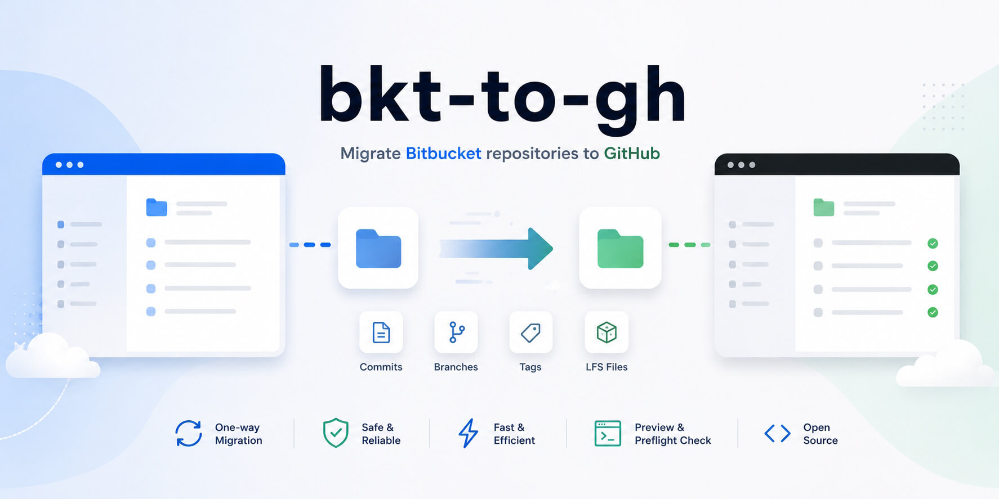

# bkt2gh



<p align="center"><strong>Go CLI for migrating Bitbucket Cloud repositories to GitHub.</strong></p>

<p align="center">
<a href="#features"><b>Features</b></a> | <a href="#requirements"><b>Requirements</b></a> | <a href="#installation"><b>Installation</b></a> | <a href="#quick-start"><b>Quick Start</b></a><br/>
<a href="#configuration"><b>Configuration</b></a> | <a href="#usage"><b>Usage</b></a> | <a href="#preview"><b>Preview</b></a> | <a href="#real-migration-behavior"><b>Real Migration Behavior</b></a><br/>
<a href="#development"><b>Development</b></a> | <a href="#license"><b>License</b></a> | <a href="README.ko.md"><b>한국어</b></a>
</p>

## Features

- List repositories in a Bitbucket Cloud workspace
- Select repositories to migrate from the terminal
- Create GitHub repositories
- Migrate Git history with mirror clone/push
- Choose GitHub repository visibility policy
- Run migration preview preflight checks
- Store encrypted configuration in the OS user config directory with environment variable overrides

## Requirements

- Git
- Bitbucket Cloud account and app password
- GitHub token

## Installation

Homebrew:

```bash
brew tap ludens/tap
brew install --cask bkt2gh
```

Verify installation:

```bash
bkt2gh --help
```

## Quick Start

1. Create the configuration file:

```bash
bkt2gh configure
```

2. Review the migration plan:

```bash
bkt2gh migrate-preview
```

3. Run the migration:

```bash
bkt2gh migrate
```

Temporarily use another Bitbucket workspace:

```bash
bkt2gh migrate-preview --workspace my-workspace
```

### Agent Skills

bkt2gh ships an agent skill (`skills/bkt2gh/SKILL.md`) that teaches coding agents how to configure and run migrations. Install it with:

```bash
npx skills add ludens/bkt-to-gh
```

This adds the `bkt2gh` skill to your detected agents (Claude Code, Codex, Cursor, Pi, and more). See [skills](https://github.com/vercel-labs/skills) for options like `-g` (global) or `--skill bkt2gh`.

## Configuration

`bkt2gh configure` creates an encrypted `config.yaml` in the OS user config directory. The encryption key is stored in the OS credential store/keychain.

Default config paths:

- Linux: `$XDG_CONFIG_HOME/bkt2gh/config.yaml`, or `~/.config/bkt2gh/config.yaml`
- macOS: `~/Library/Application Support/bkt2gh/config.yaml`
- Windows: `%AppData%\bkt2gh\config.yaml`

Required values:

- Bitbucket username
- Bitbucket app password
- Bitbucket workspace
- GitHub token
- GitHub owner or organization

Configuration priority:

1. Environment variables
2. Encrypted `config.yaml`

If a value exists in encrypted `config.yaml` and an environment variable with the same name is also set, the environment variable is used.

Supported environment variables:

```dotenv
BITBUCKET_USERNAME=you@example.com
BITBUCKET_APP_PASSWORD=your-bitbucket-app-password
BITBUCKET_WORKSPACE=your-workspace
GITHUB_TOKEN=your-github-token
GITHUB_OWNER=your-github-user-or-org
```

### Token Permissions

Bitbucket app password permissions:

- Account: Read
- Workspace membership: Read
- Projects: Read
- Repositories: Read

GitHub token permissions:

- Metadata: Read-only
- Administration: Read and write
- Contents: Read and write

When using a GitHub fine-grained token, it must be able to create repositories for the user or organization referenced by `GITHUB_OWNER`.

## Usage

```text
Usage:
  bkt2gh configure
  bkt2gh migrate-preview [--workspace name]
  bkt2gh migrate [--workspace name]

Commands:
  configure        create or update encrypted config.yaml interactively
  migrate-preview  preview migration plan without creating or pushing
  migrate          migrate selected Bitbucket repositories to GitHub

Flags:
  --workspace name  Bitbucket workspace (overrides config for this run)
  -h, --help        show help
```

### `configure`

Create or update encrypted `config.yaml` interactively. See [Configuration](#configuration).

### `migrate-preview`

List Bitbucket repositories and print a migration plan without creating or pushing. See [Preview](#preview).

### `migrate`

List Bitbucket repositories and migrate the selected repositories to GitHub. See [Real Migration Behavior](#real-migration-behavior).

### Repository Selection

When `migrate` or `migrate-preview` runs, it opens a repository selection screen.

Commands:

- Number: select/deselect that repository
- `1,3`: select/deselect multiple repositories
- `all`: select all currently visible repositories
- `none`: deselect all currently visible repositories
- `filter text`: filter by name or slug
- `done`: finish selection

### Visibility Policy

After selecting repositories, choose the GitHub repository visibility policy.

- `all-private`: create all GitHub repositories as private
- `all-public`: create all GitHub repositories as public
- `follow-source`: follow the public/private state of the Bitbucket repository

## Preview

Preview calls the Bitbucket/GitHub APIs to verify the plan, but it does not create repositories or run Git commands.

```bash
bkt2gh migrate-preview
```

Checked items:

- Whether the Bitbucket repository list can be loaded
- Whether the GitHub token and owner are accessible
- Whether target GitHub repository names are available
- Result of applying the visibility policy

## Real Migration Behavior

When `migrate` runs, each selected repository is processed in this order:

1. Clone the Bitbucket repository into a temporary directory with `git clone --mirror`
2. Create the GitHub repository
3. Change `origin` to the GitHub clone URL
4. Run `git push --mirror origin`
5. Clean up the temporary directory

If a GitHub repository with the same name already exists, it is skipped without overwriting.

## Development

Test:

```bash
go test ./...
```

Build:

```bash
go build -o bkt2gh ./cmd/bkt2gh
```

## License

- Project: [MIT](LICENSE)
- Third-party notices: [THIRD_PARTY_NOTICES.md](THIRD_PARTY_NOTICES.md)
